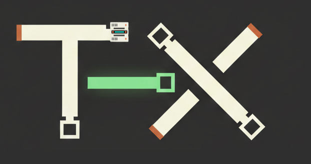
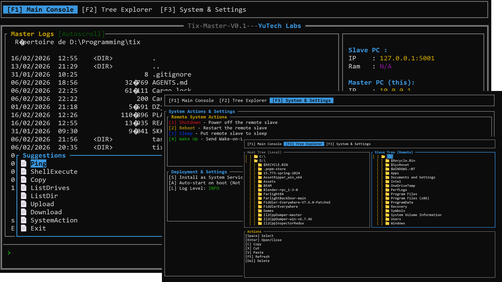

# TIX - High-Performance Remote Control Framework
<div align="center">
    
</div>
<p align="center">
  
  
  
</p>

TIX is a **high-performance command-and-control framework** designed for dedicated two-machine peer-to-peer connections over direct RJ-45 Ethernet. It provides ultra-fast remote desktop capabilities, shell command execution, file transfer, and system management features.

Overview
---

<div align="center">
    

</div>

---

## Table of Contents

1. [Features](#features)
2. [Architecture](#architecture)
3. [Quick Start](#quick-start)
4. [Building from Source](#building-from-source)
5. [Usage](#usage)
   - [tix-master (TUI)](#tix-master-tui)
   - [tix-slave](#tix-slave)
   - [tix-rdp-gui (Remote Desktop Viewer)](#tix-rdp-gui-remote-desktop-viewer)
   - [tix-rdp-slave (RDP Service)](#tix-rdp-slave-rdp-service)
6. [Configuration](#configuration)
7. [Protocol](#protocol)
8. [Troubleshooting](#troubleshooting)
9. [Roadmap](#roadmap)
10. [License](#license)

---

## Features

### Core Features

| Feature | Description |
|---------|-------------|
| **Shell Execution** | Execute commands on the remote machine with full output streaming |
| **File Transfer** | Upload/download files between master and slave |
| **Directory Browser** | Browse remote filesystem with tree view |
| **System Actions** | Shutdown, reboot, or sleep the remote machine |
| **Process List** | View running processes on the slave |
| **Auto-Reconnect** | Automatic reconnection with exponential backoff |

### Remote Desktop (RDP)

| Feature | Description |
|---------|-------------|
| **DXGI Capture** | Ultra-fast screen capture using Windows Desktop Duplication API |
| **Delta Detection** | Only send changed screen regions |
| **Zstd Compression** | High-performance compression for screen data |
| **UDP Transport** | Low-latency UDP-based screen streaming |
| **Input Injection** | Full mouse and keyboard input forwarding |
| **Adaptive Quality** | Automatic quality adjustment based on bandwidth |

### Windows Service Integration

- Install tix-rdp-slave as a Windows service
- Runs with system privileges
- Listens on `0.0.0.0` for incoming connections
- Starts automatically on boot

---

## Architecture

```
┌─────────────────────────────────────────────────────────────────┐
│                         TIX Architecture                         │
├─────────────────────────────────────────────────────────────────┤
│                                                                  │
│  ┌──────────────────────────────────────────────────────────┐   │
│  │                      tix-core                            │   │
│  │  ┌──────────┐ ┌──────────┐ ┌──────────┐ ┌──────────────┐ │   │
│  │  │ Protocol │ │  Codec   │ │ Network  │ │    State     │ │   │
│  │  │   Layer  │ │          │ │   Layer  │ │   Machines   │ │   │
│  │  └──────────┘ └──────────┘ └──────────┘ └──────────────┘ │   │
│  │       │              │             │            │          │   │
│  │       └──────────────┴─────────────┴────────────┘          │   │
│  │                        │                                     │   │
│  │              ┌─────────▼─────────┐                          │   │
│  │              │   Service Layer   │                          │   │
│  │              │ (Shell, File,    │                          │   │
│  │              │  Screen, Update)  │                          │   │
│  │              └───────────────────┘                          │   │
│  └──────────────────────────────────────────────────────────┘   │
│                              │                                    │
│              ┌───────────────┼───────────────┐                   │
│              │               │               │                   │
│              ▼               ▼               ▼                   │
│      ┌─────────────┐ ┌─────────────┐ ┌─────────────┐             │
│      │  tix-master │ │  tix-slave  │ │  tix-rdp-*  │             │
│      │  (TUI/CLI)  │ │  (Service)  │ │   (RDP)     │             │
│      └─────────────┘ └─────────────┘ └─────────────┘             │
│                                                                  │
└─────────────────────────────────────────────────────────────────┘
```

### Components

| Component | Description |
|-----------|-------------|
| **tix-core** | Core protocol library with packet handling, codec, network, and RDP modules |
| **tix-master** | Terminal-based UI for controlling the slave |
| **tix-slave** | Connects to master and executes commands |
| **tix-rdp-gui** | Remote desktop viewer (master side) |
| **tix-rdp-slave** | Screen capture service (slave side, runs as Windows service) |

---

## Quick Start

### Prerequisites

- **Rust 1.75+** - Install via [rustup](https://rustup.rs/)
- **Windows 10/11** - Required for RDP features (DXGI capture)
- **Visual Studio Build Tools** - For Windows API bindings

### Clone and Build

```bash
# Clone the repository
git clone https://github.com/your-repo/tix.git
cd tix

# Build all components
cargo build --release

# Or build individual components
cargo build --release -p tix-master
cargo build --release -p tix-slave
cargo build --release -p tix-rdp-gui
cargo build --release -p tix-rdp-slave
```

---

## Building from Source

### Development Build

```bash
# Debug build (faster compilation)
cargo build

# Run tests
cargo test --workspace

# Run with logging
RUST_LOG=debug cargo run -p tix-master
```

### Release Build (Production)

```bash
# Optimized release build
cargo build --release

# The binaries will be in:
# target/release/tix-master.exe
# target/release/tix-slave.exe
# target/release/tix-rdp-gui.exe
# target/release/tix-rdp-slave.exe
```

### Build Requirements

```bash
# Install Rust (if not already installed)
curl --proto '=https' --tlsv1.2 -sSf https://sh.rustup.rs | sh

# Ensure you have the stable toolchain
rustup default stable

# Add Windows target for cross-compilation (if needed)
rustup target add x86_64-pc-windows-msvc
```

---

## Usage

### tix-master (TUI)

The master provides a terminal-based user interface for interacting with the slave.

```bash
# Run with default settings (connects to localhost:4321)
cargo run --release -p tix-master

# Or use the built binary
./target/release/tix-master.exe
```

#### Keyboard Shortcuts

| Key | Action |
|-----|--------|
| `F1` | Main tab (command execution) |
| `F2` | File browser tab |
| `F3` | System actions tab |
| `F5` | Refresh file browser |
| `Enter` | Execute command |
| `Space` | Select file(s) |
| `c` | Copy selected |
| `x` | Cut selected |
| `v` | Paste |
| `q` | Quit |
| `Ctrl+C` | Quit |

#### Command Syntax

```
# Execute shell command
shell <command>

# List directory
list <path>

# Copy file/directory
copy <source> <destination>

# Upload file
upload <local_path>

# Download file
download <remote_path>

# System actions
SystemAction shutdown
SystemAction reboot
SystemAction sleep
```

---

### tix-slave

The slave connects to the master and waits for commands.

```bash
# Run with default settings (connects to localhost:4321)
cargo run --release -p tix-slave

# Connect to specific master
# Edit the source or use environment variables
```

The slave automatically:
- Reconnects on disconnect with exponential backoff
- Handles shell commands, file operations, and system actions
- Runs indefinitely until stopped

---

### tix-rdp-gui (Remote Desktop Viewer)

The GUI client for viewing the remote desktop.

```bash
# Run with default config
cargo run --release -p tix-rdp-gui

# Specify slave address
./target/release/tix-rdp-gui.exe --slave 192.168.1.100:7332

# Generate default config
./target/release/tix-rdp-gui.exe --gen-config
```

#### Command-Line Options

| Option | Description | Default |
|--------|-------------|---------|
| `--config <path>` | Config file path | `tix-rdp-gui.toml` |
| `--slave <addr>` | Slave address | From config |
| `--gen-config` | Print default config | - |

---

### tix-rdp-slave (RDP Service)

The RDP slave runs as a Windows service, capturing the screen and accepting input.

```bash
# Run in console mode (for testing)
cargo run --release -p tix-rdp-slave

# Install as Windows service (requires admin)
./target/release/tix-rdp-slave.exe --install

# Uninstall Windows service
./target/release/tix-rdp-slave.exe --uninstall

# Generate default config
./target/release/tix-rdp-slave.exe --gen-config
```

#### Service Features

- **Listens on**: `0.0.0.0:7332` (TCP control), `0.0.0.0:7331` (UDP screen)
- **Runs as**: Windows service with system privileges
- **Auto-start**: Configured to start on boot

---

## Configuration

### tix-rdp-gui.toml

```toml
[network]
slave_address = "192.168.1.100:7332"
timeout_ms = 5000

[display]
width = 1920
height = 1080
fullscreen = false
vsync = true

[performance]
target_fps = 60
buffer_size = 3
quality = "high"

[input]
capture_mouse = true
capture_keyboard = true
capture_clipboard = false

[logging]
level = "info"
file = "tix-rdp-gui.log"
```

### tix-rdp-slave.toml

```toml
[network]
listen_port = 7331
control_port = 7332
max_connections = 1

[screen]
capture_quality = "high"
fps = 60
delta_detection = true
block_size = 64
monitor_index = 0

[performance]
target_bandwidth_mbps = 100
adaptive_quality = true

[logging]
level = "info"
file = "tix-rdp-slave.log"
```

---

## Protocol

### Wire Format

TIX uses a 64-byte header followed by a variable-length payload:

```
Offset  Size   Field
──────────────────────────────────────
  0       4    Magic: "TIX1"
  4      32    Checksum: Blake3 hash
 36       4    MessageType: Command | Response
 40       8    Flags: ProtocolFlags bitmask
 48       8    RequestID: Unique identifier
 56       8    PayloadLength: Bytes following
```

### Command IDs

| ID | Command | Description |
|----|---------|-------------|
| 0x0001 | Ping | Keep-alive |
| 0x0002 | Hello | Handshake |
| 0x0003 | Goodbye | Disconnect |
| 0x0101 | ShellExecute | Run command |
| 0x0201 | ListDir | List directory |
| 0x0202 | FileRead | Read file |
| 0x0203 | FileWrite | Write file |
| 0x0301 | SystemInfo | Get system info |
| 0x0302 | SystemAction | Shutdown/reboot |
| 0x0401 | ScreenStart | Start RDP |
| 0x0402 | ScreenStop | Stop RDP |
| 0x0501 | UpdateCheck | Check updates |
| 0x0502 | UpdatePush | Push update |

---

## Troubleshooting

### Connection Issues

```
# Verify network connectivity
ping <slave_ip>

# Check ports are open
netstat -an | findstr "4321"
```

### RDP Issues

```
# Ensure slave is running as service
sc query TixRdpService

# Check firewall rules
netsh advfirewall firewall show rule name=all | findstr "7331"
```

### Build Issues

```
# Clean and rebuild
cargo clean
cargo build --release

# Update dependencies
cargo update
```

---

## Roadmap

See [PLAN.md](PLAN.md) for the complete development plan.

### Implemented

- [x] Core protocol with Blake3 checksums
- [x] Shell command execution
- [x] File transfer (upload/download)
- [x] Directory browsing
- [x] System actions (shutdown/reboot/sleep)
- [x] TUI master interface
- [x] RDP with DXGI capture
- [x] Delta detection
- [x] Windows service for RDP slave

### Planned (Phase 9)

- [ ] Update protocol for pushing new slave versions
- [ ] Inno Setup installer for slave
- [ ] Service runs on all interfaces (`0.0.0.0`)
- [ ] Full system privileges

---

## License

MIT License - see [LICENSE](LICENSE) for details.

---

## Contributing

Contributions are welcome! Please read [AGENTS.md](AGENTS.md) for development guidelines.

### Code Style

```bash
# Format code
cargo fmt

# Run lints
cargo clippy

# Run tests
cargo test
```
